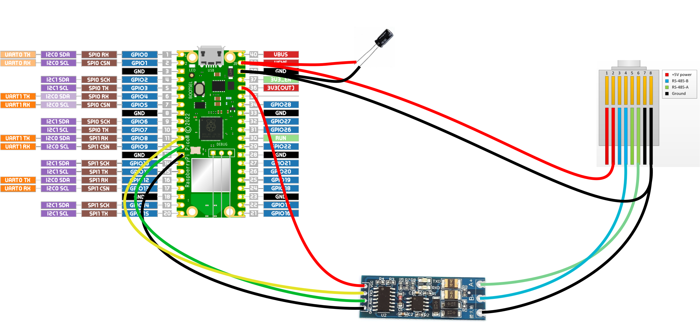

# PicoEpever

This is a firmware for Raspberry Pico. It publish on Grafana Cloud data from Epever Solar Charger.

## Components

1 Capacitor (100 µF or more)
1 RS485 to TTL converter (ex: https://it.aliexpress.com/item/1005001621746811.html)
1 Raspberry PICO (with optional breakout board, ex: https://it.aliexpress.com/item/1005004709248186.html)

